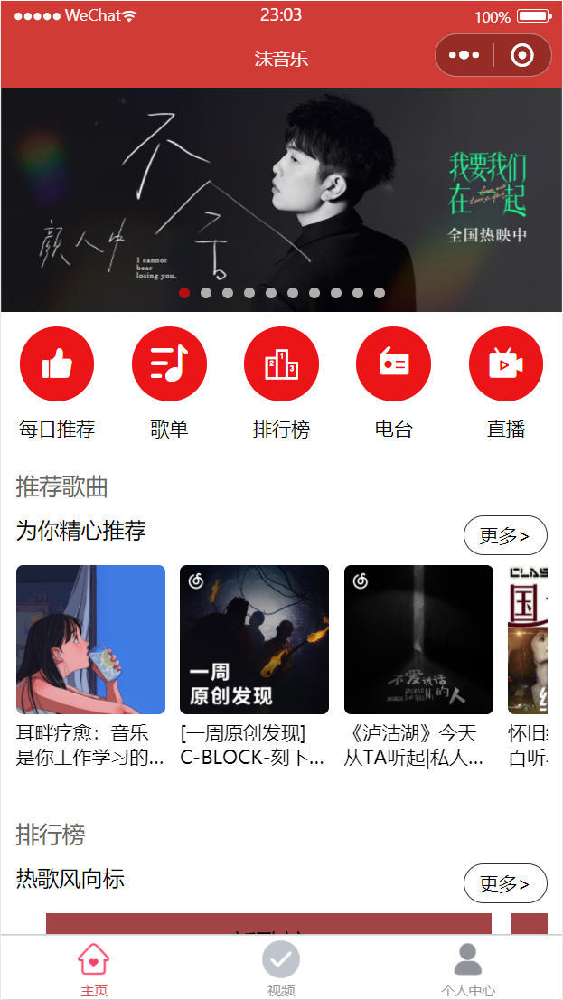
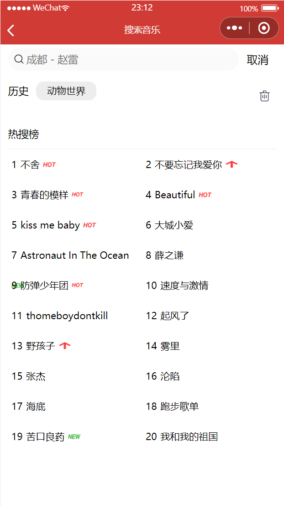

# NeteaseMusicSprogram
# 微信小程序-网易云音乐App

> Vue+Nodejs 仿网易云音乐 Android 客户端实战
>
> 学习微信小程序迭代而出的产品，根据小破站某视频教学更新优化而来
>
> 项目开源于GitHub，与各位大佬一起学习进步，接口均来自网易云官方真实接口
>
> 演示地址：`暂无` 微信官方表示个人用户不能上线音乐产品  😅

## ✨ 特性

基础模组：
- [x] 轮播图
- [x] 推荐歌单
- [x] 排行榜
- [x] 每日推荐歌曲

视频 & 歌曲模组：

- [ ] 推荐MV
- [x] 获取推荐视频 & 播放
- [ ] 视频&歌曲 评论 点赞 回复
- [x] 歌曲图片显示
- [x] 歌曲切换效果
- [ ] 歌单排序
- [ ] 随机播放
- [ ] 播放进度条个性化

个人信息：

- [x] 手机登录
- [ ] 邮箱登录
- [x] 头像 账户信息 简介获取
- [x] 最近播放歌曲

搜索模组：

- [x] 热搜列表
- [x] 搜索默认关键词
- [ ] 搜索多重匹配


- 安装 

  ```
  $ git clone git@github.com:bymori/NeteaseMusicSprogram.git
- 运行 `cd 至 netease_api`

  ```
  $ node app.js
- 使用说明

  - 项目目录结构

    ```html
    mo_music                        // 沫音乐
    ├── components                  // 组件
    ├── netease_api        		    // Node版本网易云音乐接口
    ├── pages                       // 小程序页面
    │       └── index                 // 首页
    │       └── login                 // 登录页
    │       └── personal              // 个人中心
    │       └── recommendSong         // 每日推荐
    │       └── search                // 搜索页
    │       └── songDetail            // 音乐详细页
    │       └── video                 // 视频页
    ├── utils                       // 工具
    │       └── request.js            // 请求封装体
    ├── static                      // 静态资源/图片
    ```
    
    - 需要 NodeJS 8.12+ 环境
    - 安装 微信小程序开发者工具 最新版 
    - 项目导入后 勾选微信开发工具相应配置
      - ES6 转 ES5
      - 增强编译
      - 使用npm模块
      - 不校验合法域名、web-view(业务域名)、TLS版本以及 HTTPS 证书

  ### 技术栈
  - 微信原生小程序开发
  - WX组件 & API: 使用原生架构建设
  - ajax：发起http请求
  - ES6：采用ES6语法。
  - HTML5: 项目主体结构搭建
  - JavaScript: 对网页行为进行编程
  - CSS3：CSS3动画及样式。

## 💻 配置开发环境

本项目由 [NeteaseCloudMusicApi](https://github.com/Binaryify/NeteaseCloudMusicApi) 提供 API，已经包含在本项目的`netease_api`目录

### 部署至 Vercel

1. 部署网易云 API，详情参见 [Binaryify/NeteaseCloudMusicApi](https://neteasecloudmusicapi.vercel.app/#/?id=安装) 。你也可以将 API 部署到 `Vercel`
2. 点击本仓库右上角的 Fork，复制本仓库到你的 GitHub 账号
3. 打开 [Vercel.com](https://vercel.com/)，使用 GitHub 登录
4. 点击 `Import Git Repository` 并选择你刚刚复制的仓库并点击 `Import`
5. 点击 `PERSONAL ACCOUNT` 旁边的 `Select`
6. 点击 `Environment Variables`，填写 Name 为 `VUE_APP_NETEASE_API_URL`，`Value` 为你刚刚部署的网易云 API 地址，点击 Add。最后点击底部的 Deploy 就可以部署到 Vercel 了

## 📜  开源许可
本项目仅供个人学习研究使用，禁止用于商业及非法用途。

基于  [MIT license](https://opensource.org/licenses/MIT) 许可进行开源。

## 💡灵感来源

API 源代码来自 [Binaryify/NeteaseCloudMusicApi](https://github.com/Binaryify/NeteaseCloudMusicApi)

- 如果有帮助到您请点个star ，感谢哦 ! ! !

## 🖼️ 截图






